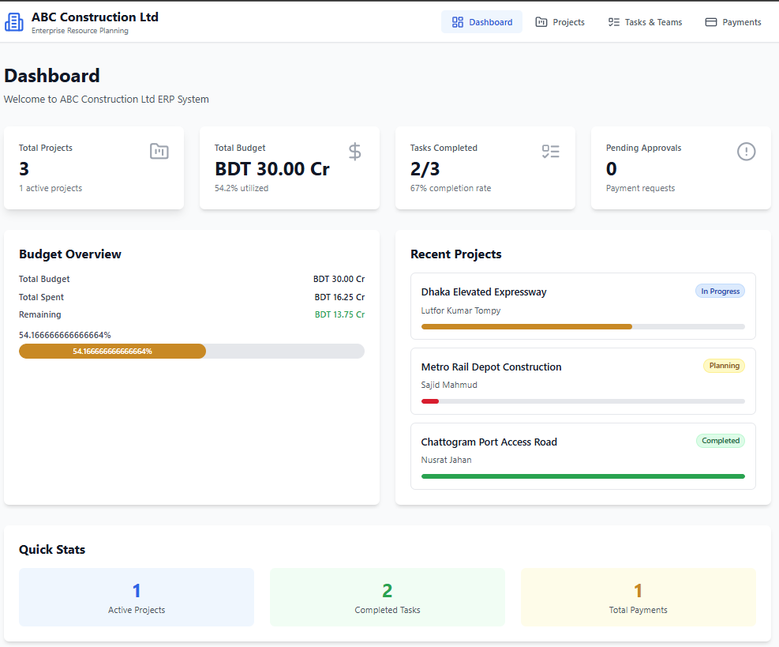
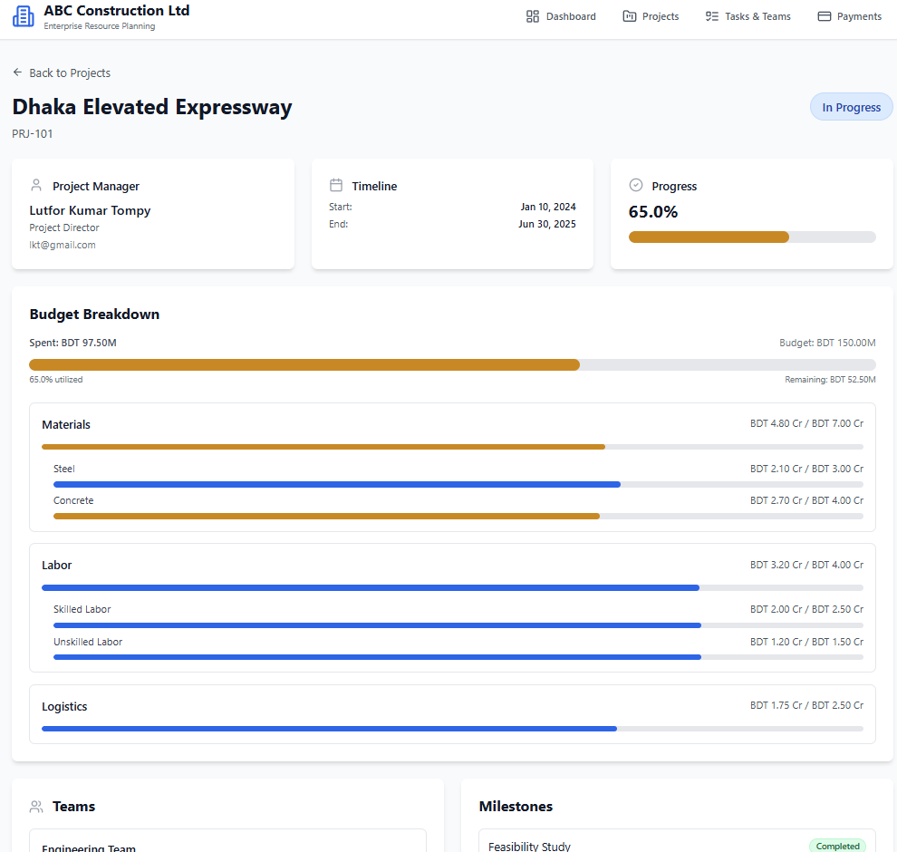
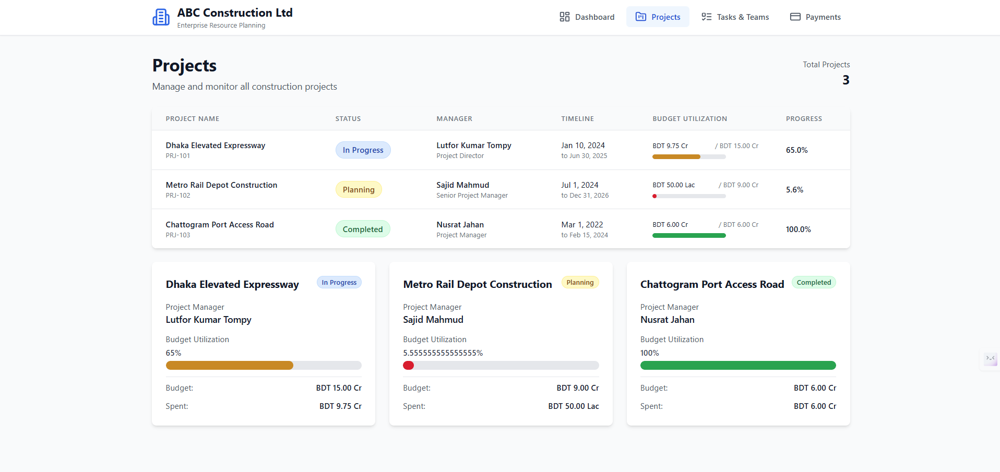
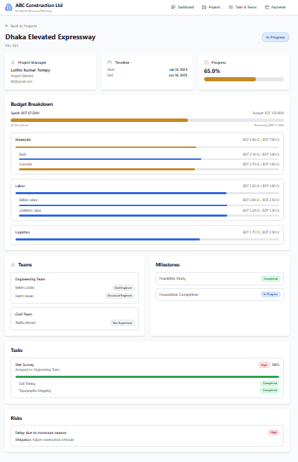
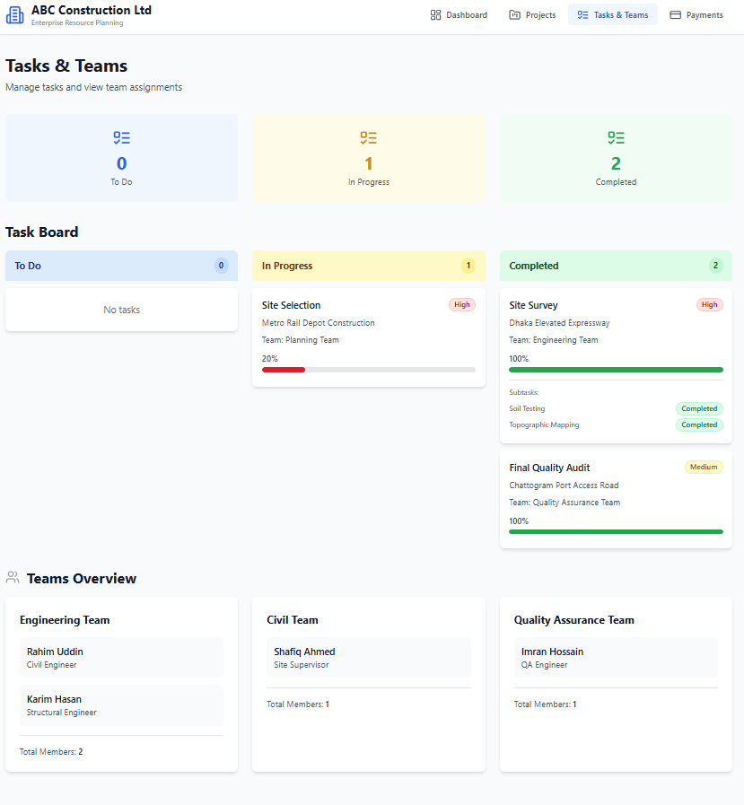
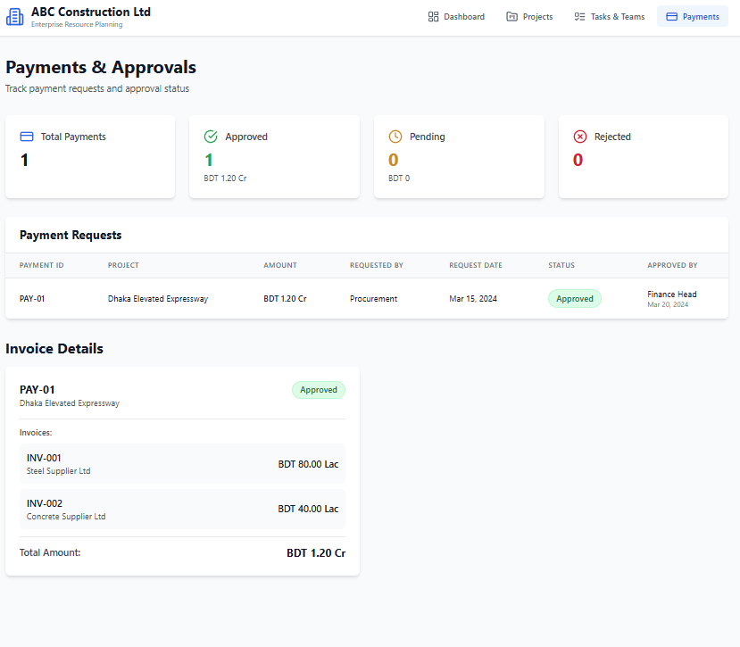

# 🏗️ ABC Construction ERP System

🔗 **Live Demo:** https://abc-construction-ehtashamul.netlify.app  

A modern, data-driven **Web ERP application** built using **React (Vite + TypeScript)** for managing construction projects, budgets, tasks, teams, and financial approvals.

Designed specifically for **non-technical business users**, the system emphasizes **clarity, usability, and clean UI/UX**.

---

## 🎥 Demo Video

[](https://www.youtube.com/watch?v=rEVnr-a597E)

Watch a complete walkthrough of the system, including dashboard insights, project tracking, task management, and payment approvals.

---

## 🚀 Features

### 🏠 Dashboard
- Company overview (ABC Construction Company)
- Total projects, tasks, and pending approvals
- Aggregated **budget vs. spent**
- Clean KPI cards and quick insights


### 📋 Project Management
- View all projects with:
  - Status badges (Active / Completed / Delayed)
  - Budget utilization (progress bars)
  - Project manager details
- Navigate to detailed project insights


### 📄 Project Details
- Project metadata (status, timeline, manager)
- Budget breakdown by categories
- Task progress tracking
- Assigned team overview

### 👥 Tasks & Teams
- Tasks grouped by status (To Do / In Progress / Completed)
- Priority indicators (High / Medium / Low)
- Assigned team members
- Completion percentages

### 💳 Payments & Approvals
- Track payment requests
- Approval workflow (Pending / Approved / Rejected)
- Requested by / Approved by tracking

---

## 🧱 Tech Stack

- **Frontend:** React + Vite + TypeScript  
- **Styling:** Tailwind CSS  
- **State/Data Handling:** Local JSON + Service Layer  
- **Architecture:** Component-based, reusable UI  

## 🛠 Installation & Setup

Follow these steps to run this project locally.

### 🔹 Prerequisites

Make sure you have installed:

- **Node.js (v18+)** — https://nodejs.org/
- **npm** (comes with Node) or **yarn**
- **Git**

### 🔹 Clone the Repository

```bash
git clone https://github.com/EhtashamulIslam/ABC_Construction.git
cd ABC_Construction


🔹 Install Dependencies
# Using npm
npm install

# Or using yarn
yarn install


🔹 Start the App
npm run dev
# or
yarn dev

Open in browser
Go to http://localhost:3000
The project should now be running locally.